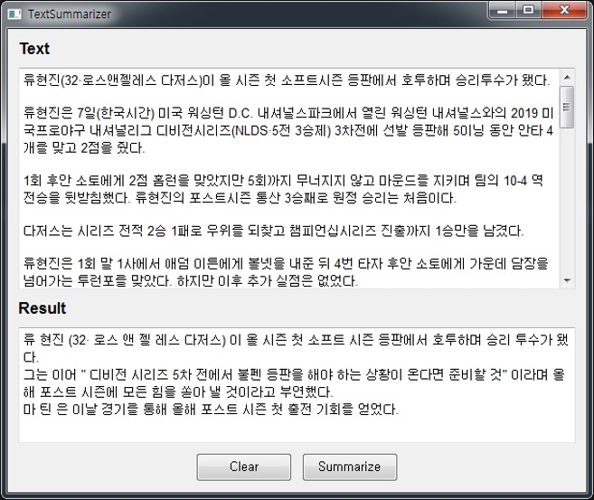

# TextSummraizer
A sentence summary project using the TextRank algorithm

## Overview
### TextRank
2004년 Rada Mihalcea와 Paul Tarau의 [TextRank: Bringing Order into Texts 논문](https://web.eecs.umich.edu/~mihalcea/papers/mihalcea.emnlp04.pdf)을 참고

## Dependencies
+ KoNLPy : 한글을 분석하고 문장 단위를 분리하기 위해 사용하는 패키지
+ JPype1 : KoNLPy 사용하기 위해 필수 패키지
+ Twitter : 분리한 문장에서 명사만 추출하기 위해 사용
+ scikit-learn : 머신러닝 패키지 중 하나, TF-IDF 모델을 생성하는 사용

## Result

